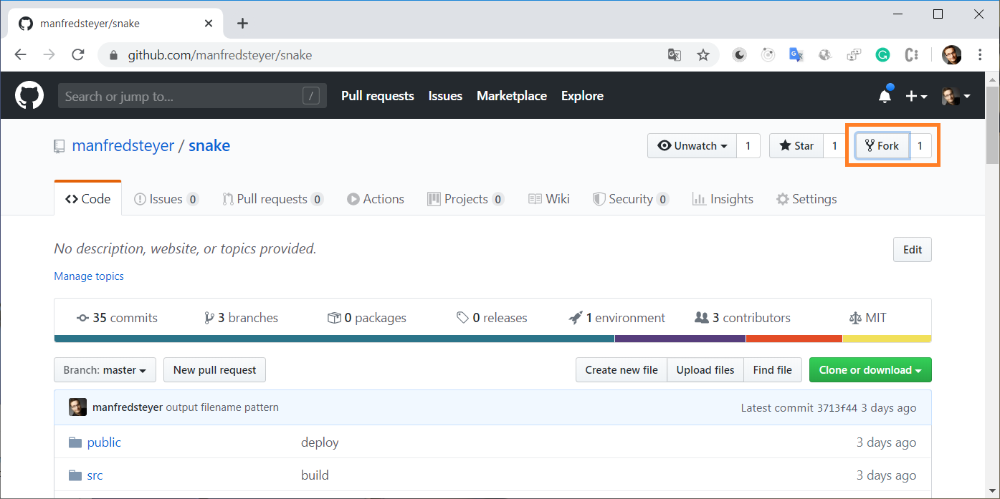
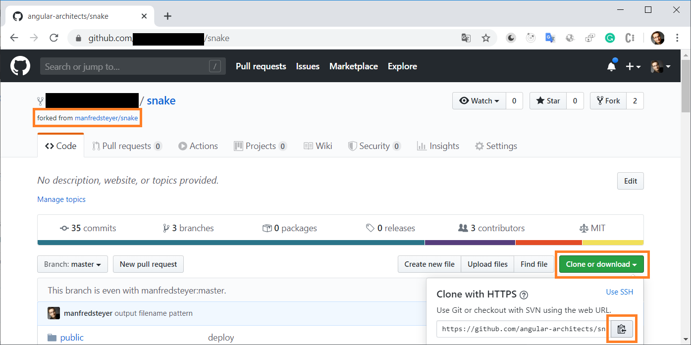
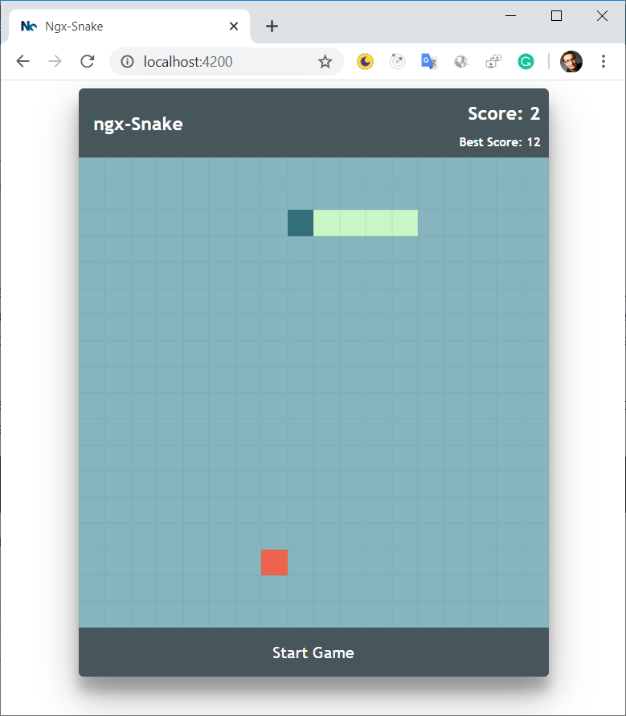
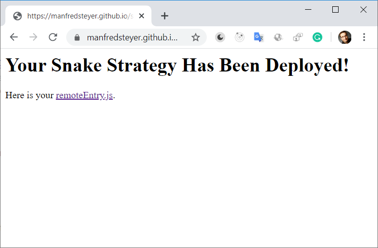
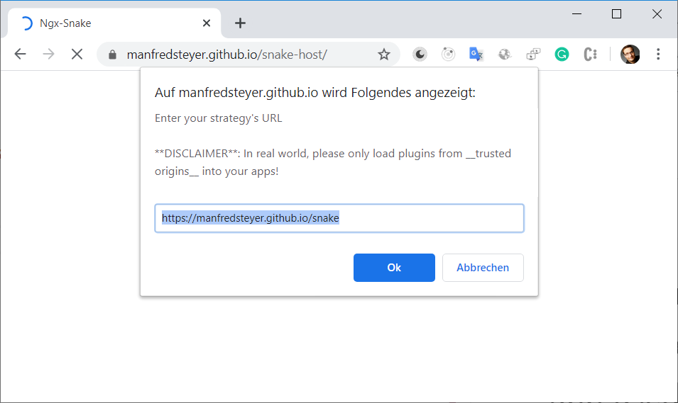

# ngx-Snake Module Federation Challenge

## Credits
This is a fork of https://github.com/SamirHodzic/ngx-snake.

Big thanks for this nice example!

## TLDR

- Fork this repo and implement your own strategy for navigating the snake (**use yarn!!**)
- Compile it as a Module Federation (``yarn build``) remote and publish it to GitHub pages until **June, 18th** (there is a ``deploy.js`` node script for this)
- Fill out [this form to hand in your solution](https://tinyurl.com/federation-challenge)
- Join the [Award Ceremony](https://www.meetup.com/de-DE/ngCopenhagen/events/270827005)


## Goal
The goal of this contest is to write a strategy navigating the snake. Maximize the amount of fruits it is eating during the **first 500 moves**:

- In the case of a tie after 500 moves, we will increase this limit.

- The **game mode** used for the evaluation is ``Obstacles`` (just play the Game to find out what this means ;-)).

## Get into the right mood

Before getting started, **play** the [interactive version](https://samirhodzic.github.io/ngx-snake/) of snake to get into the right mood:

https://samirhodzic.github.io/ngx-snake/
	

## Getting started

To take part in this challenge, you need to **fork** this repository:

1. **Fork** this repo to be capable of providing your own implementation.
   
    

2. Copy **your fork's URL:**

	

3. Clone your fork:

	```
	git clone https://github.com/<your-account>/snake.git
	```

4. Install all dependencies with **yarn** (**not npm**!). 
   
   We really need yarn here to prevent that the two used versions of webpack (webpack 5 for Module Federation and webpack 4 for the Angular CLI) collide.

	**Remarks**: If you don't have yarn, you can easily install it with ``npm i -g yarn``.

	```
	cd snake
	yarn
	```

5. Start the project and see the very simple baked-in strategy for controlling the snake in action:

	```
	yarn start
	```

	**Hint:** Start with the easiest game option called _without walls_:

	

6. Now it's your turn: Open the file ``custom.strategy.ts`` and implement your own strategy for navigating the snake:
   
  - The method ``step`` is called before each move. It gets the game's state like the snake's position, the fruit's position and potential walls (not every game mode has a walls) and returns the new direction of the snake (up, down, left, right):
   
	```
	step(context: Context): SnakeDirection { ... }
	```

  - Please only use TypeScript code and no Angular-specifics for this strategy as using Module Federation with Angular is currently not possible (without some tricks we've used in our PoCs).


## After coding: Publish your solution

1. **Important**: Open your ``webpack.config.js`` and adjust the public path to reflect your GitHub user name:

	```javascript
	output: {
		publicPath: "https://manfredsteyer.github.io/snake/",
		[...]
	}
	```

	**Remarks:** Here, we are using beta 16 of webpack 5 and Module Federation. This version demands us to define where the remote will be hosted. In future versions, this won't be necessary. 

2. Commit and push the source code to your repo:
   
   ```
   git add *
   git commit -m "your meaningful commit message"
   git push
   ```

3. Compile your strategy into a Module Federation Remote:

	```
	yarn build
	```

4. Deploy your strategy to GitHub Pages by calling the preexisting ``deploy.js`` script in your project's root:

	```
	node deploy.js
	```

5. Assure yourself that the deployment worked by navigating to:

	```
	https://<github-user-name>.github.io/snake
	```

	If everything worked, you should see a simple welcome page:

	

	You can ignore the link ;-)


## Test your implementation within our snake app

1. Navigate to https://manfredsteyer.github.io/snake-host/

2. Enter the location of your strategy:

	

3. See your strategy in action.

	**Hint:** If your strategy isn't picked up, try a hard reload (``CTRL+F5``).

## Hand-in your solution

Fill out [this form](https://tinyurl.com/federation-challenge) until Thu, June, 18th 2020:

https://tinyurl.com/federation-challenge

## Award Ceremony

The Award Ceremony takes place during the next [ngCopenhagen Meetup](https://www.meetup.com/de-DE/ngCopenhagen/events/270827005). There, we'll present the best 3 received strategies. 